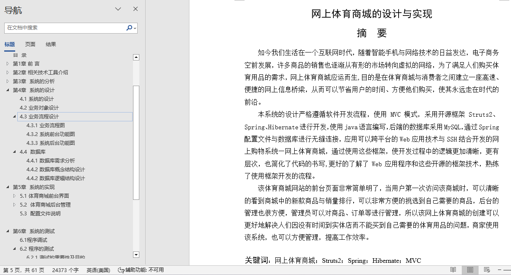
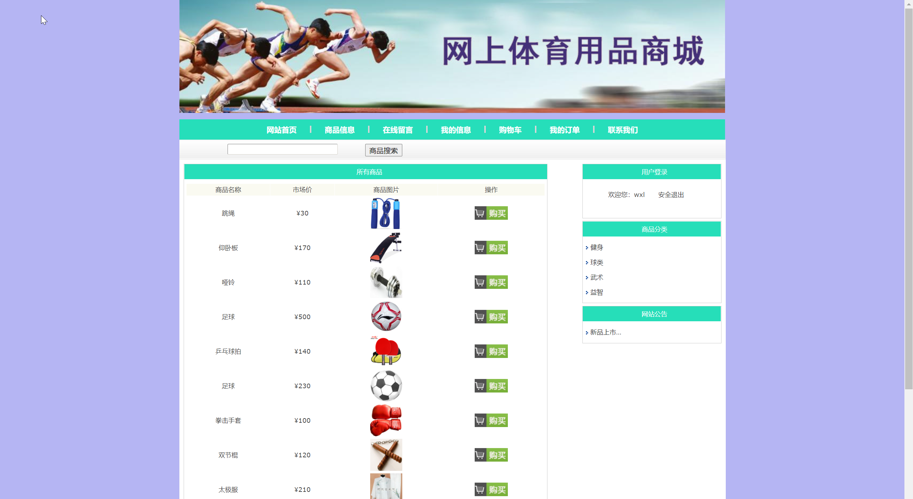
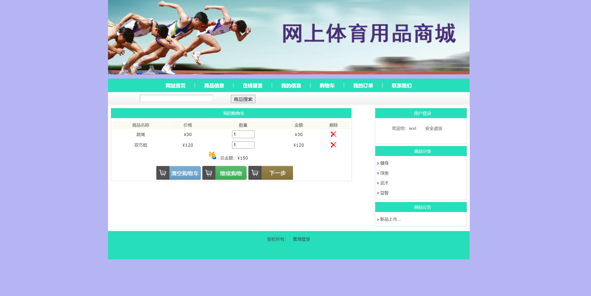
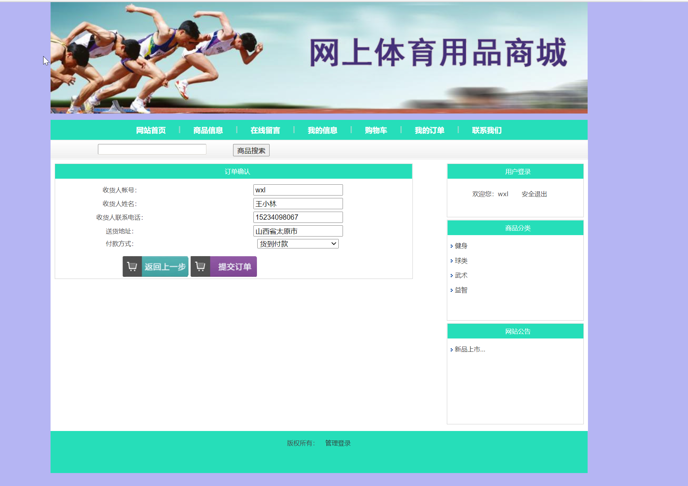
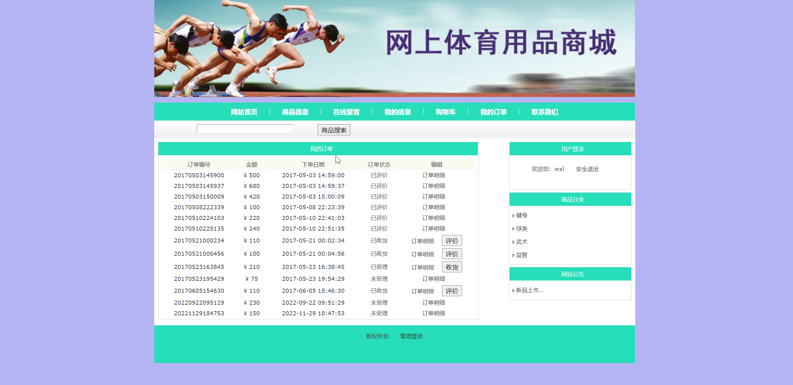
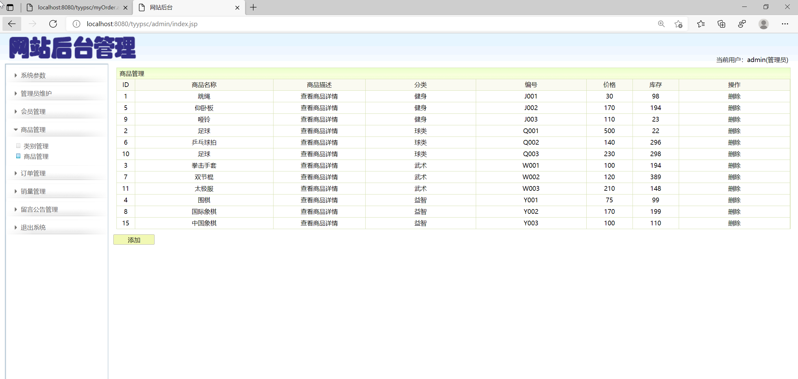
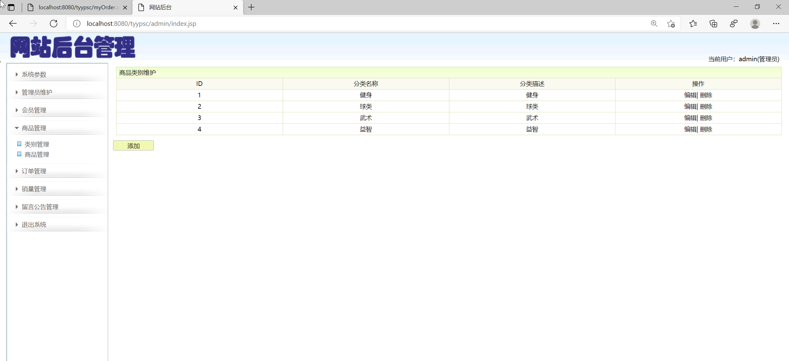
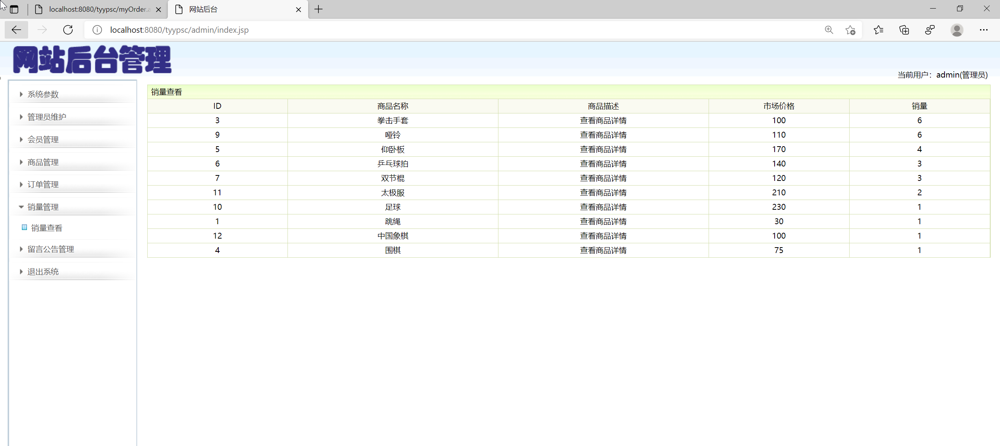
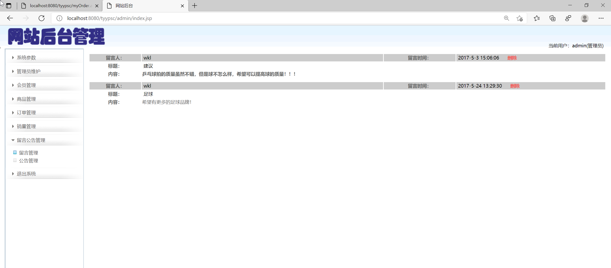
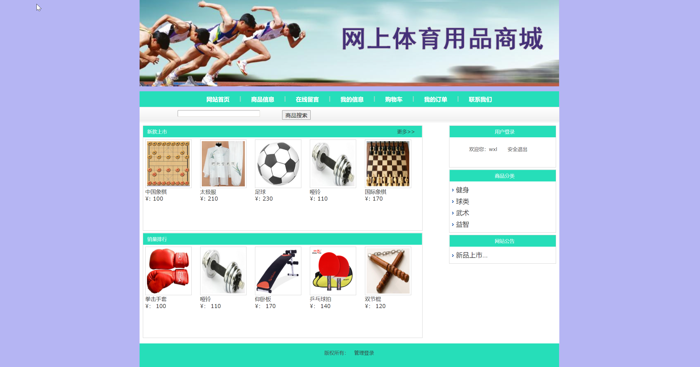

## 基于JSP+Servlet实现的网上体育用品商城系统(程序+报告)

###  获取sql数据库文件: 从戎源码网 (https://armycodes.com/) QQ: 386869957 QQ群: 377586148
###  所有系统地址: (https://github.com/YuLin-Coder/AllProjectCatalog) 
###  所有项目以及源代码本人均调试运行无问题 可支持远程安装部署调试、定制修改、代码讲解

## 项目介绍
基于JSP+Servlet实现的网上体育用品商城系统，主要功能如下

网上体育商城的主要功能包括：前台用户登录退出、注册、在线购物、修改个人信息、
（1）商品浏览模块：
首页浏览最新上市商品，按销量排行显示商品
实现根据商品名称搜索商品信息
实现根据商品分类浏览商品
（2）登录、注册：
购物前需要登录，如果没有账号则可以先注册
（3）在线留言：
登录后可以发表留言
（4）修改个人信息：
登录后可修改个人信息
（5）提交、查询订单：
商品加入购物车后可以提交订单，也可以查看自己的所有订单
（6）购物车模块：
登录后可以查看自己购物车中的商品
（7）后台管理员模块
用户登录功能：通过账号登录系统。
修改登录密码功能：修改管理员的登录密码
会员管理功能：查询所有会员，删除会员
类别管理：查询所有类别，添加、修改、删除商品类别
商品管理：查询所有商品，添加、删除商品
订单管理：显示所有订单，查询订单明细，受理、删除订单
销量管理：查看所有商品的销量
留言管理：查看所有留言，删除留言
公告管理：查看所有公告，添加、删除公告

## 项目技术
- 编程语言：Java
- 数据库：MySQL
- 前端技术：JSP、JavaScript、bootstrap、JQuery
- 后端技术：Servlet、JDBC

## 运行环境
- JDK版本：JDK1.8及以上
- 开发工具：IDEA、Ecplise、Myecplise都可以
- 数据库: MySQL5.7及以上

## 运行截图

